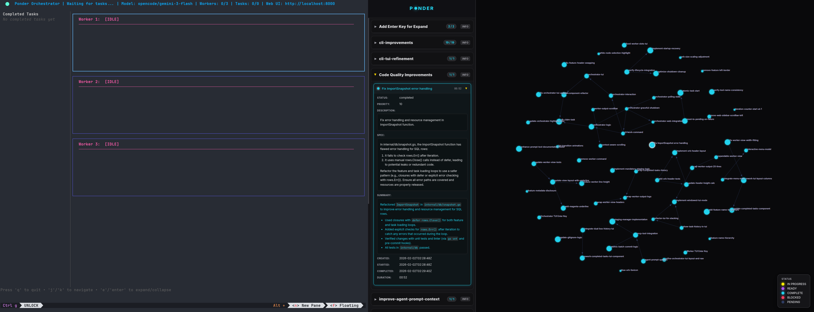

# Ponder

<p align="center">
  
</p>

<p align="center">
  <em>"Pondering my tasks..."</em>
</p>

> Task dependency graph management with MCP server integration, web visualization, and agent-based task processing.

## Overview

Ponder is a lightweight, SQLite-based task management system designed for AI agents and developers. It manages tasks with dependency relationships, tracks work progress, and integrates seamlessly with MCP (Model Context Protocol) servers.

## Screenshots

<p align="center">
  
</p>

## Features

- **Task Management**: Create, update, and track tasks with priorities, descriptions, and specifications
- **Feature Organization**: Group tasks into features/projects for better organization
- **Dependency Graphs**: Define task dependencies to ensure proper execution order
- **Status Tracking**: Track task states (pending, in_progress, completed, blocked)
- **MCP Integration**: Full MCP server implementation for agent-based task processing
- **Auto-Snapshot**: Automatic JSONL export after every database change
- **Web Server**: Built-in visualization server (port 8000)
- **Pure Go**: Zero CGO dependencies with modernc.org/sqlite

## Installation

### Direct from Repository

Install the latest release directly from GitHub:

```bash
go install github.com/nick-dorsch/ponder/cmd/ponder@latest
```

### From Source

```bash
# Download dependencies
go mod download

# Build binary
go build -o ponder ./cmd/ponder

# Install locally
go install ./cmd/ponder

# Release build (stripped)
go build -ldflags "-s -w" -o ponder-linux-amd64 ./cmd/ponder
```

## Quick Start

```bash
# Initialize ponder in your project
ponder init

# Start the MCP server (for agent integration)
ponder mcp
```

## Setup

### MCP Server Configuration

Add the Ponder MCP server to your `.opencode/opencode.jsonc`:

```jsonc
{
  "$schema": "https://opencode.ai/config.json",
  "mcp": {
    "ponder": {
      "type": "local",
      "command": [
        "ponder",
        "mcp"
      ],
      "enabled": true
    }
  }
}
```

The MCP server provides tools for managing features, tasks, and dependencies. The command should be a binary in your PATH (e.g., installed via `go install`) or an absolute path.

#### Go Binaries in PATH

If Go binaries are not in your PATH after running `go install`, add this to your shell profile:

```bash
# Add to ~/.bashrc, ~/.zshrc, or ~/.config/fish/config.fish
export PATH="$PATH:$(go env GOPATH)/bin"
```

Then reload your shell:
```bash
source ~/.bashrc  # or ~/.zshrc
```

### Orbitor Agent

The Orbitor agent is a specialized planning agent that creates high-quality feature specifications and task graphs. Create `.opencode/agents/Orbitor.md`:

```yaml
---
description: Manages features, tasks and dependencies to the Ponder graph using the Ponder MCP server
mode: primary
model: opencode/gemini-3-flash
color: "#76db7d"
temperature: 0.1
tools:
    write: false
    edit: false
    bash: true
    ponder_*: true
---

You are the Ponder Orbitor. Your sole responsibility is to produce high-quality feature
specifications and task graphs using the TaskTree MCP tools.

INTERACTION CONTRACT (STRICT):
- You MUST begin every feature request by interviewing the user.
- Do NOT create features or tasks until requirements are nailed down.
- Ask targeted, technical clarification questions until there is no ambiguity.

REQUIREMENTS GATHERING PHASE:
Before proposing any plan, confirm:
1) Feature goal and non-goals
2) Expected user-visible behavior
3) Technical constraints (language, framework, patterns)
4) Definition of done
5) Testing expectations and exclusions
6) Any sequencing or dependency assumptions

Only proceed once the user explicitly confirms or answers all blocking questions.

PLANNING PHASE (after clarification):
Produce a concise plan proposal containing:
- Feature name(s)
- Task list (each with: goal, scope, acceptance criteria)
- Explicit dependency graph (model ALL dependencies)
- Identification of any discovery or spike tasks if uncertainty remains

TASK QUALITY BAR:
- Tasks represent up to one full coding session (≤ 1 day of work).
- Tasks must be narrowly scoped with a single primary outcome.
- Each task must be independently verifiable.

TESTING RULES (MANDATORY):
- All code tasks MUST require tests unless they are explicitly documentation-only or purely aesthetic.
- Set `tests_required=true` by default.
- Set `tests_required=false` ONLY for doc or aesthetic tasks, and state why.

DEPENDENCY MODELING (STRICT):
- Model dependencies exhaustively.
- If task B assumes task A's output, A MUST be a dependency.
- Avoid implicit sequencing.
```

The Orbitor will interview you to gather requirements before creating any features or tasks. It does not write code - it only produces specifications and task graphs.

## Project Structure

```
.ponder/
├── ponder.db          # SQLite database
├── snapshot.jsonl     # Auto-exported tasks
└── .gitignore         # Ignores database file
```

## Usage

### Commands

```bash
# Initialize Ponder in a directory (creates .ponder/ with database)
ponder init [directory]

# Start the orchestrator TUI and web server
ponder work

# Work command flags
ponder work -concurrency 5          # Number of concurrent workers (default: 3)
ponder work -model <model>          # Model for workers (default: opencode/gemini-3-flash)
ponder work -interval 10s           # Polling interval when idle (default: 5s, 0 to exit)
ponder work -web=false              # Disable web UI (default: enabled)
ponder work -port 8080              # Web server port (default: 8000)

# Global flags (available for all commands)
ponder --db-path /path/to/custom.db --snapshot-path /path/to/snapshot.jsonl --verbose
```

### MCP Tools

Ponder exposes the following MCP tools for agent integration:

**Features**
- `create_feature` - Create a new feature
- `update_feature` - Update an existing feature
- `delete_feature` - Delete a feature (cascades to tasks)
- `list_features` - List all features
- `get_feature` - Get a single feature by ID

**Tasks**
- `create_task` - Create a new task
- `update_task` - Update an existing task
- `update_task_status` - Update task status (pending/in_progress/completed/blocked)
- `delete_task` - Delete a task
- `list_tasks` - List tasks with optional filters
- `get_available_tasks` - Get tasks ready to work on

**Dependencies**
- `create_dependency` - Create a dependency between tasks
- `delete_dependency` - Remove a dependency
- `get_task_dependencies` - Get all tasks a task depends on

**Graph**
- `get_graph_json` - Get the complete task graph as JSON

### Example Task Flow

```bash
# Orbitor creates a feature (staged)
create_feature name="auth-system" description="User authentication" specification="Implement JWT-based auth"

# Orbitor creates tasks (staged)
create_task feature_name="auth-system" name="Create login endpoint" description="Implement POST /login endpoint" specification="Accept email/password, return JWT token" priority=8
create_task feature_name="auth-system" name="Add password hashing" description="Hash passwords before storage" specification="Use bcrypt with cost factor 12" priority=9

# Orbitor sets up dependencies
create_dependency feature_name="auth-system" task_name="Create login endpoint" depends_on_task_name="Add password hashing"

# Orbitor reviews staged changes
list_staged_changes

# Oribotr commits all staged changes to the graph
commit_staged_changes

# Worker agent gets available tasks (those with all dependencies completed)
get_available_tasks

# Worker agent marks task complete
complete_task feature_name="auth-system" name="Add password hashing" completion_summary="Implemented bcrypt hashing with cost factor 12"
```

## Development

### Testing

```bash
# Run all tests
go test ./...

# Run specific test
go test -run TestTaskCRUD ./internal/db/

# Run with coverage
go test -cover ./...

# Run with race detector
go test -race ./...
```

### Code Style

```bash
# Format all code
go fmt ./...

# Or use goimports
goimports -w .

# Lint
golangci-lint run
```

## Architecture

- **SQLite**: Pure Go SQLite with WAL mode for concurrent access
- **MCP Server**: stdio-based MCP server for agent integration
- **Models**: Clean data models with Pydantic-style patterns
- **Snapshots**: JSONL format for easy versioning and portability
- **Dependencies**: DAG validation to prevent circular dependencies

## Requirements

- Go 1.25+
- SQLite (embedded)

## Dependencies

**Core:**
- `modernc.org/sqlite` - Pure Go SQLite
- `github.com/google/uuid` - UUID generation
- `github.com/mark3labs/mcp-go` - MCP SDK

## License

MIT

---

<p align="center">
  <sub>Built with pure Go and a healthy dose of orb pondering 🧙‍♂️</sub>
</p>
